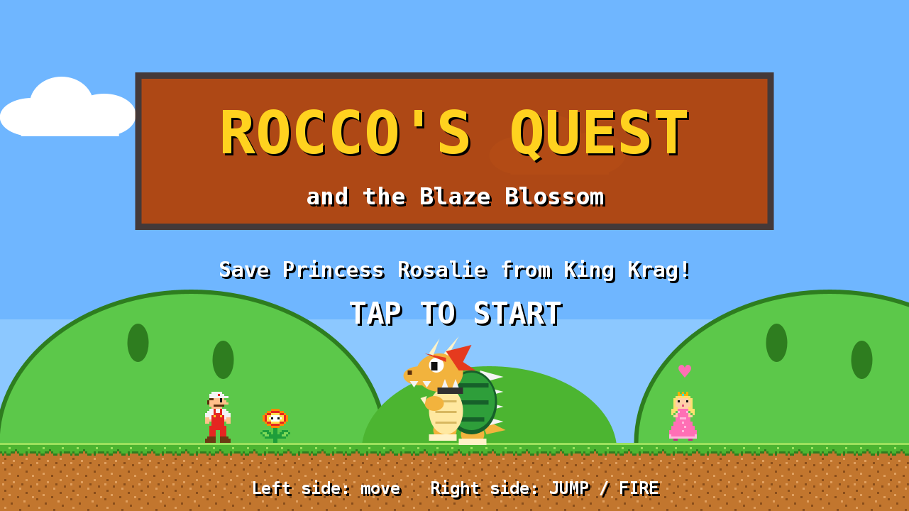
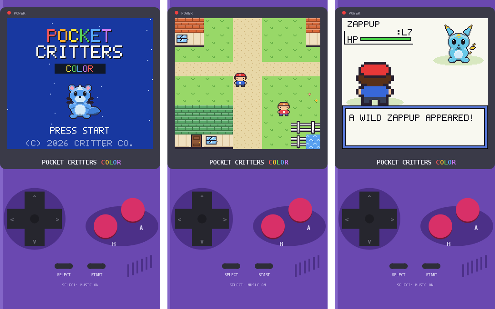

# Rocco's Quest and Pocket Critters

Two retro games for Android:

* **Rocco's Quest**: a side-scrolling platformer (below).
* **Pocket Critters Color**: a monster-catching RPG in the style of the old handheld color
  games. See [Pocket Critters](#pocket-critters-color).

A retro side-scrolling platformer for Android.

Rocco, a plumber in a red cap, has to rescue **Princess Rosalie** (she wears pink) from
**King Krag**, a giant spiky-shelled turtle dragon. Grab the **Blaze Blossom** to
throw bouncing fireballs and take Krag down.



## The game

There are three worlds with four levels each:

| Level | Name | What's there |
|---|---|---|
| 1-1 | Meadow Hills | ? blocks, pipes, Grumblers and Shellbacks. Ends at a flagpole and castle. |
| 1-2 | Crystal Caverns | Underground, with blue bricks, coin runs and an exit door. |
| 1-3 | Cloudtop Heights | Clouds and floating islands over bottomless pits, plus winged Grumblers. |
| 1-4 | Krag's Fortress | Lava pits, then the first fight with King Krag. Pip has bad news... |
| 2-1 | Sunset Dunes | A desert at sunset, with pyramids and cacti in the background. |
| 2-2 | Deep Caverns | A longer, harder underground level. |
| 2-3 | Starlight Skyway | A night-time sky level with lots of flyers. |
| 2-3 | | ...and Krag Jr. attacks in his flying clown car! |
| 2-4 | Krag's Volcano | A long lava castle and a tougher fight with King Krag. |
| 3-1 | Frosty Peaks | Slippery snow and ice. Bring the Ice Flower! |
| 3-2 | Glacier Grotto | More snow, a Skip-a-Doo Toilet and Boomadaboom. |
| 3-3 | Blizzard Pass | Icy ledges and two Boomadabooms. |
| 3-4 | Pipe Gorge | Pipes, flyers and a Krag Jr. ambush. |
| 3-5 | Sky Armada | A sky level that ends in a Krag Jr. battle. |
| 3-6 | Krag's Last Stand | Krag Jr. in the great hall, then the final battle. Zoom the Hedgehog smashes the wall and you rescue Princess Rosalie! |
| ★-1 | Wonder Meadow | **Bonus**, unlocked by rescuing the princess. Harder, with a Wonder Flower. |
| ★-2 | Wonder Skies | **Bonus** sky level with Wonder mode, and a last showdown with Krag Jr. |

Power-ups come out of `?` blocks:

* **Super Mushroom**: Rocco grows big and can smash bricks.
* **Blaze Blossom**: Rocco turns white and red and throws bouncing fireballs.
* **Ice Flower**: Rocco turns light blue and throws iceballs that freeze enemies into ice
  blocks. You can stand on the blocks.
* **Boomerang Flower**: Rocco gets an orange and green outfit and throws a boomerang that comes
  back to him and grabs coins on the way.
* **Super Star**: 10 seconds of invincibility. Touching enemies bowls them over, and there's
  special music.
* **Mini Mushroom**: Rocco shrinks to tiny size and can float high into the sky. One hit and
  he's out, though!
* **Blue Shell**: Rocco wears a blue shell. FIRE launches a winged blue shell that hunts down
  the nearest enemy and explodes. Run, and he tucks into his shell and spins along, smashing
  enemies and bricks.
* **Bullet Blaster**: a cannon outfit. FIRE shoots big bullets that fly straight through walls
  and bowl over every enemy in their path (2 damage to bosses).

* **Builder Hammer**: a yellow hard hat. SMASH breaks bricks *and* silver blocks, and bonks bad guys.
* **1-Up Mushroom** (green): an extra life.

If you get hit with a flower power, you drop back to big Rocco. Big Rocco shrinks to small Rocco.

Moves:

* **Run**: double-tap a direction and keep holding it.
* **Crouch**: swipe down on the ground.
* **Butt slam**: swipe down in mid-air. It smashes straight through bricks, opens `?` blocks
  from above, knocks out enemies and sends a shockwave along the ground.
* **Grumblers**: stomp them or burn them. **Winged Grumblers** hop around. Stomp one once to clip its wings.
* **Shellbacks**: stomp one to hide it in its shell, then kick the shell into other enemies.
* **Clouds**: you can jump up through them from below and land on top.
* **King Krag**: breathes fire and jumps. Hit him with fireballs, iceballs or the boomerang
  (6 hits in the fortress, 10 in the volcano, 14 at the last stand), or get past him and touch
  the **axe** to drop the bridge into the lava.
* **Krag Jr.**: flies a clown car, drops spiked balls and swoops at Rocco. He shakes and shows a
  red **!** before each dive. The screen locks until you beat him (4 damage). Stomp the car
  (2 damage), butt slam it (3), or use a power-up. Each of his arenas has a Super Mushroom block.
* **Grab Krag's tail**: Krag is slow to turn around. Jump over him, and while his back is turned
  a **GRAB** button appears. Rocco spins him around and throws him into the sky!
* **Boomadaboom**: Krag's big cousin. He leaps at Rocco and lands with a smash that breaks bricks
  and hurts Rocco if he's standing nearby. Takes 3 stomps.
* **Friends**: Zoom the Hedgehog smashes the wall in front of the princess, Captain Zap (a space
  ranger) jets in now and then to zap a bad guy, and Ring-Ding Frog scoots by every couple of levels
  singing his crazy song. A bouncing **Puzzle Cube** is friendly: bounce on it for a super jump and a coin.
* **Skip-a-Doo Toilet**: crouch on it to flush yourself ahead to the next one.
* **Snack break**: between worlds, Rocco eats a donut and says "That's-a great!" out loud, using
  the phone's own text-to-speech with an Italian voice.
* **Save slots**: three save slots on the title screen. Progress is saved at the start of each level.
* **Wonder mode** (bonus levels): touch the Wonder Flower and the level goes wild. The sky turns
  rainbow, the ground wobbles, Rocco floats, and spike balls, coins and flyers rain down. Grab
  the **Wonder Seed** to end it and get 5000 points.
* You start with 3 lives, and 100 coins gives you an extra one. After a Game Over you continue
  from the start of the current world.

### Music

Every area has its own looping 8-bit tune. They are all original songs written for this game:
a bouncy meadow theme, a spooky cavern bass line, an airy sky waltz-pop, a tense castle march
and a fast boss battle theme. The music is synthesized on the phone, NES-style, with two square
waves, a triangle bass and noise drums, so there are no audio files. Tap the **♪** button
(top right) to turn the music on or off.

### Controls

* **Left half of the screen**: move left and right (you can slide your thumb between the arrows).
  Double-tap and hold to run.
* **Swipe down** anywhere: crouch, or butt slam while in the air.
* **JUMP** (hold it to jump higher) and **FIRE** on the right.
* **II** in the top-right corner pauses the game, and **♪** turns the music on or off.
* Keyboards and game controllers also work: arrow keys or WASD, Shift to run,
  Down or S to crouch/slam, Space to jump, X to fire, M for music.

## Pocket Critters Color



An original critter-catching adventure that plays in portrait mode on a handheld console drawn on
your screen. It has a 160 x 144 pixel screen, a D-pad and A / B / START / SELECT buttons.

* **Pick a starter** in Prof. Hazel's lab: **Embit** (fire), **Drizzlet** (water) or
  **Sproutle** (grass). Your rival Ryder takes the one that's strong against yours.
* **22 critters** to find, with 9 types (Normal, Fire, Water, Grass, Electric, Rock, Flying, Bug
  and Ghost) and a full type chart. Most of them evolve.
* **Wild critters** live in tall grass and caves. Weaken them, then throw a **Capsule** to catch
  them. Sleep and paralysis make catching easier.
* **Turn-based battles** with 40+ moves, PP, stat changes, critical hits, burn / poison /
  paralysis / sleep, XP, level ups, learning moves and evolution.
* **Trainers** spot you when you walk into their line of sight. There are three **Gyms**: Granita
  (Rock) in Maple City, Marina (Water) in Tideport and Volta (Electric) in Sparkton.
* Earn all three badges to enter **Summit Cave**. At the peak you'll face Ryder one last time
  and meet the legendary **Solaris**.
* **Critter Centers** heal your team, and their PC stores extra critters. **Marts** sell
  Capsules and Potions. You also get a Critterdex, a Trainer Card and a save game.
* Every town and route has its own chiptune music, and every critter has its own cry. All of it is
  synthesized on the phone.

Controls: the on-screen D-pad moves; **A** talks, reads signs and confirms; **B** cancels (hold it
to run); **START** opens the menu; **SELECT** turns the music on or off. The phone's back button
also works as B. Keyboards and controllers work too (arrows / WASD, Z = A, X = B,
Enter = START, Shift = SELECT).

The game autosaves when you leave the app, and you can save any time from the START menu.

## Installing on your phone

Every push builds an APK with GitHub Actions (see `.github/workflows/android.yml`):

1. On your phone, open
   **https://github.com/avgeropoulos/sp-ceb-llD3stroyer/releases/latest/download/RoccosQuest.apk**
   or **https://github.com/avgeropoulos/sp-ceb-llD3stroyer/releases/latest/download/PocketCritters.apk**
   in Chrome. Both are also in the latest release on the repository page.
2. Download the APK and open it. If Android asks, allow your browser to install unknown apps.

## Building it yourself

You need JDK 17 and the Android SDK (Android Studio installs both).

```sh
./gradlew :app:assembleDebug     # APK at app/build/outputs/apk/debug/app-debug.apk
./gradlew :core:test             # game-logic tests; also renders screenshots to core/build/screens
                                 # and the music to core/build/music/*.wav
./gradlew :critters-app:assembleDebug   # Pocket Critters APK in critters/app/build/outputs/apk/debug/
./gradlew :critters-core:test           # its tests; screenshots go to critters/core/build/critter-shots
```

You can also open the folder in Android Studio and press Run.

## Code layout

* `core/`: the whole game in plain Kotlin with no Android dependencies. It covers physics, levels,
  enemies, the boss and rendering through a small `Gfx` interface. All art is pixel art defined
  in code (`Sprites.kt`), so the game has no image files.
  The music lives in `Songs.kt`, written in a tiny note notation, and `Chiptune.kt` turns it into audio.
* `app/`: the Android layer. A `SurfaceView` game loop, multitouch controls, a `Canvas`
  renderer, sound effects that are synthesized at startup, and a streaming music player.

Levels are built in `core/.../Level.kt` with a small builder, so adding a new one is a few lines.

Pocket Critters lives in `critters/`:

* `critters/core/`: the whole game in plain Kotlin. It draws into a 160 x 144 frame buffer in
  software (`Gfx.kt`), so it looks pixel-perfect on any phone.
  * `Data.kt` has types, moves, species and items, and `Battle.kt` has the battle rules.
  * `Maps.kt` has the towns, routes, NPCs and story scripts.
  * `Game.kt` runs the overworld and scripts. `BattleScene.kt` and `Ui.kt` are the battle
    screen and menus.
  * Critter pictures are painted from shapes in `CritterArt.kt`; tiles and people are pixel art
    in `Art.kt`.
  * It reuses Rocco's Quest's chiptune synthesizer for its own songs (`Audio.kt`).
* `critters/app/`: the Android layer: a portrait `SurfaceView`, touch controls on the drawn
  console, sound and music.
