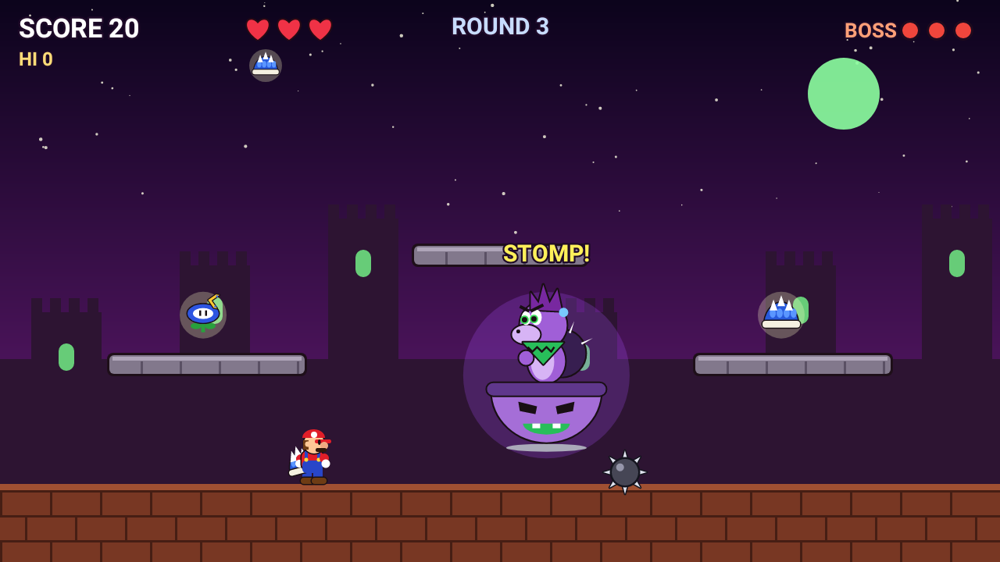

# Spike Rush Jr.

An Android arcade game: a bratty prince in a flying propeller pod hurls spiked balls at a
plumber hero. The spikes stay planted where they land, so the floor fills up and you have to
keep finding safe ground. When the prince swoops down low, jump on his head. Three stomps
win the round, and every round gets faster and meaner.


## How to play

| Control | Touch | Keyboard / gamepad |
| --- | --- | --- |
| Move | ◀ ▶ buttons (bottom-left) | ← → or A / D |
| Jump (hold for higher) | ▲ button (bottom-right half of the screen) | Space, ↑, W, or gamepad A |
| Use power-up | ✸ button (appears left of jump when you hold a power) | J, X, Left Shift, or gamepad B / X |

- **Red `!` markers** show where a thrown spike is about to land.
- **Planted spikes** blink right before they vanish. You get +5 for each one you outlast.
- **Coins** (+100) pop up on the platforms.
- **Swoop:** after a few throws the prince dives down and sweats. Stomp him for +500,
  but touching the pod or the propeller from the side hurts.
- Clearing a round gives a bonus and an extra life (max 5). The music speeds up each round.

## Power-ups

Every 11–17 seconds a power-up appears on the ground or a platform. Grab it before it
blinks out.

| Power-up | What it does |
| --- | --- |
| 🔥 **Fire Flower** | Throw bouncing fireballs. They burn up spikes (+20). Four fireball hits on the boss knock off one HP. |
| 🪃 **Boomerang Flower** | Throw a boomerang that flies out, curves back to you, and slices through every spike in its path both ways. It also clips a swooping boss's propeller, so floor throws hit him. Two hits knock off one boss HP. |
| 🐚 **Blue Shell** | Wear a spiny blue shell. Press the action button to tuck in and slide across the floor for 2.2s. You smash spikes, bounce off walls, can still jump, and hit a swooping boss. |
| ❄️ **Ice Flower** | Throw ice balls that skate along the floor. Frozen spikes turn into **ice blocks you can stand on** (they melt after 6s). Hit the boss to freeze him solid for 2.6s: he can't move or throw. |
| ⭐ **Star** | 8 seconds of rainbow invincibility with its own fast theme song. Run faster, smash spikes by touching them, and ram the boss to hurt him. |
| ⛏️ **Drill** | Press the action button on the floor to dig under it. You're untouchable underground and can move around for up to 3s. Press again to burst out, which smashes spikes above you and hits a swooping boss from below. |

Fire, Ice, Boomerang, Shell and Drill stay until you get hit. As in the classics, a hit **costs the power-up
instead of a life**. Tip: shots skim the floor, so jump before shooting to hit a swooping boss.


## The Dark Prince

From **round 3** the prince turns purple, with a green scarf and glowing green eyes. He rides a
purple pod with a dark aura, and the arena turns to a green-moon night.



## Boss attacks

Attack patterns unlock as you progress:

1. **Lob**: an aimed throw that leads your movement. **Spread**: three at once.
2. **Carpet bomb**: he flies across the arena laying a row of spikes with a 2-slot gap.
   **Roller**: a spike ball that rolls at you (jump it!).
3. **Spike rain** from the sky.


## Music and sound

Everything is synthesized in real time (`Synth.kt`), with no audio files. The soundtrack
(`Music.kt`) is an original chiptune boss march in C minor in the style of a cocky "villain
kid" theme:
square-wave lead with vibrato, fast arpeggiated offbeat "brass" stabs, an oom-pah triangle
bass and noise drums, plus a sneaky chromatic bridge (Fm → Cm → D♭ → G7).

The theme comes in four variations that get more ominous as the rounds get harder:

| Rounds | Theme | Sound |
| --- | --- | --- |
| 1 | **Brat March** | The cocky original, 148 BPM |
| 2 | **Rising Tension** | Four-on-the-floor kick, pumping bass, syncopated stabs, 154 BPM |
| 3 | **Dark Prince** | Half-time stomp at 136 BPM: melody an octave lower in a hollow tone, Phrygian (♭2) notes, tritone bass and diminished stabs |
| 4+ | **Final Rage** | The dark version at 164 BPM with a 16th-note bass chug, nonstop hats and longer fills; it keeps speeding up each round |

There are also
round-clear and game-over jingles, an 8-second F-major star theme, and retro sound
effects.

## Building

The project has no dependencies beyond the Kotlin standard library. All graphics are
drawn with `Canvas`.

- **Android Studio:** open the folder and press Run.
- **Command line** (needs the Android SDK, JDK 17):
  ```
  ./gradlew assembleDebug
  adb install app/build/outputs/apk/debug/app-debug.apk
  ```
- **No setup:** every push runs the **Build APK** GitHub Actions workflow. Download the
  `spike-rush-apk` artifact from the run, copy `app-debug.apk` to your phone and open it
  (allow "install unknown apps").

Requires Android 7.0 (API 24) or newer. Landscape only.

## Code map

| File | What it does |
| --- | --- |
| `MainActivity.kt` | Full-screen immersive activity, lifecycle |
| `GameView.kt` | Game loop thread (fixed 120 Hz step), screen scaling, multi-touch and key input |
| `Game.kt` | Hero physics, boss AI and attacks, spikes, coins, collisions, all drawing |
| `Synth.kt` | Real-time chiptune synthesizer and sound effects (AudioTrack) |
| `Music.kt` | Song data and compositions |
