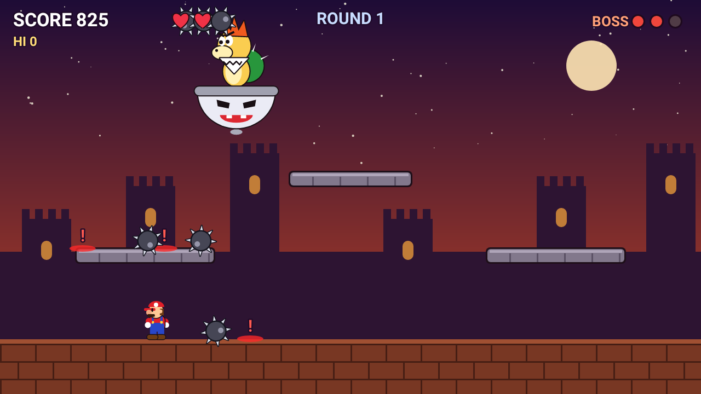
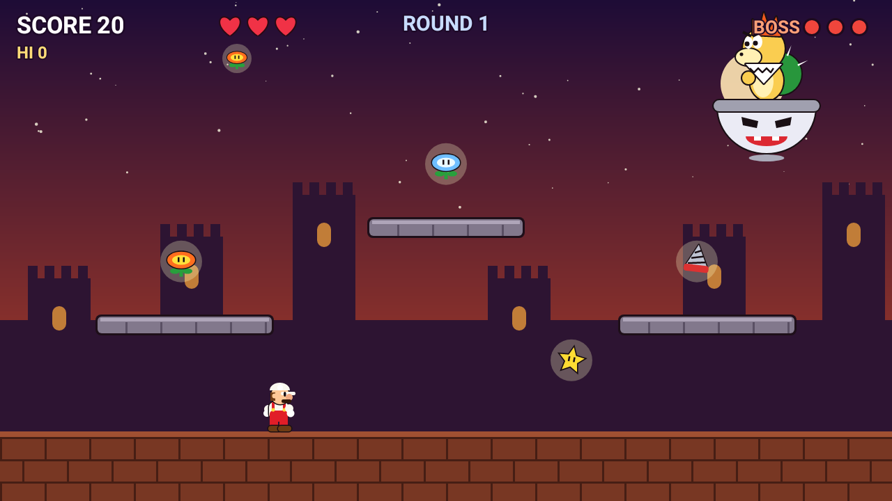
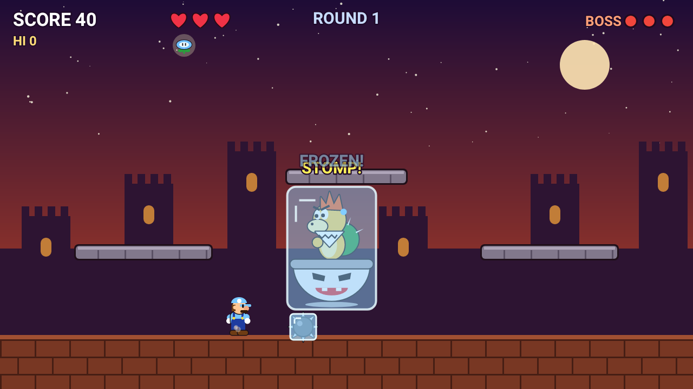
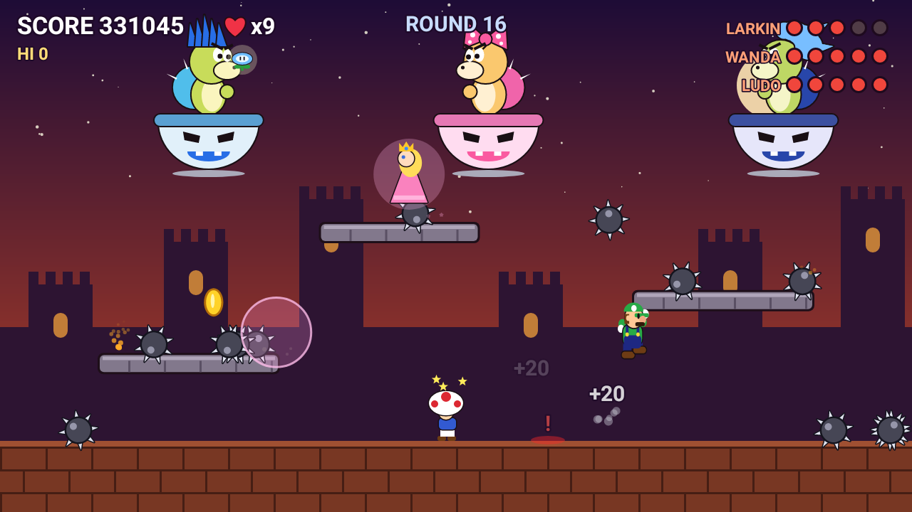
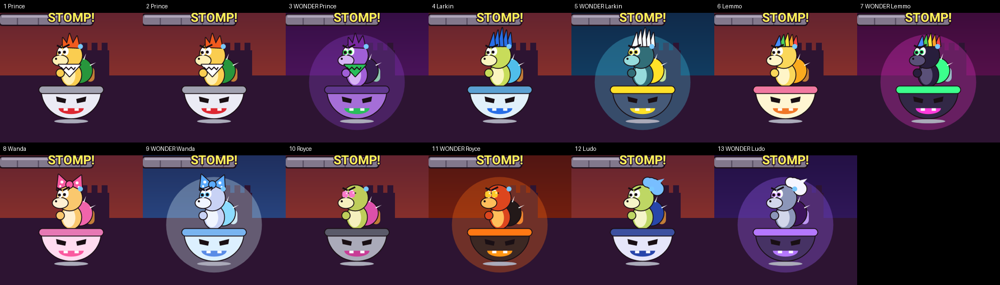
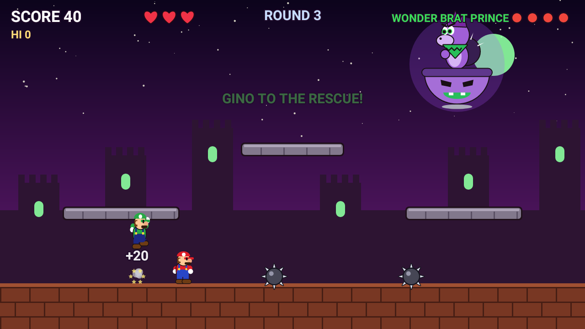
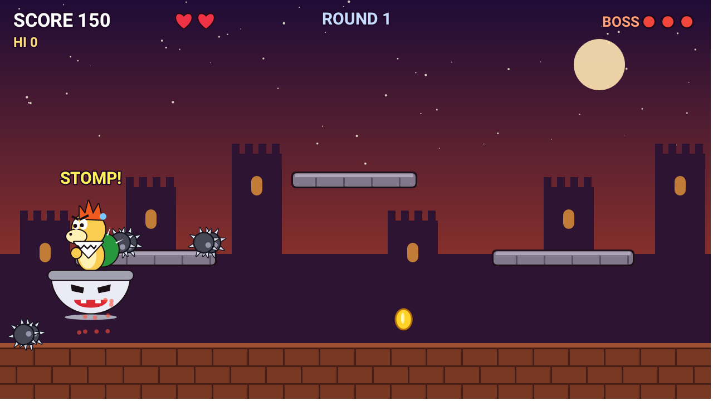

# Spike Rush Jr.

An Android arcade game: a bratty prince in a flying propeller pod hurls spiked balls at a
plumber hero. The spikes stay planted where they land, so the floor fills up and you have to
keep finding safe ground. When the prince swoops down low, jump on his head. Three stomps
win the round, and every round gets faster and meaner.



## How to play

| Control | Touch | Keyboard / gamepad |
| --- | --- | --- |
| Move | ◀ ▶ buttons (bottom-left) | ← → or A / D |
| Jump (hold for higher) | ▲ button (bottom-right half of the screen) | Space, ↑, W, or gamepad A |
| Use power-up | ✸ button (appears left of jump when you hold a power) | J, X, Left Shift, or gamepad B / X |

- **Red `!` markers** show where a thrown spike is about to land.
- **Planted spikes** blink right before they vanish. You get +5 for each one you outlast.
- **Coins** (+100) pop up on the platforms.
- **Swoop:** after a few throws the prince dives down and sweats. Stomp him for +500,
  but touching the pod or the propeller from the side hurts.
- Clearing a round gives a bonus. The music speeds up slightly each round.
- **Game over?** Tap **Continue** to retry from the same round (with a fresh score) or **New Game**.

## Power-ups

Every 11–17 seconds a power-up appears on the ground or a platform. Grab it before it
blinks out.

| Power-up | What it does |
| --- | --- |
| 🔥 **Fire Flower** | Throw bouncing fireballs. They burn up spikes (+20). Four fireball hits on the boss knock off one HP. |
| 🪃 **Boomerang Flower** | Throw a boomerang that flies out, curves back to you, and slices through every spike in its path both ways. It also clips a swooping boss's propeller, so floor throws hit him. Two hits knock off one boss HP. |
| 🐚 **Blue Shell** | Wear a spiny blue shell. Press the action button to tuck in and slide across the floor for 2.2s. You smash spikes, bounce off walls, can still jump, and hit a swooping boss. |
| ❄️ **Ice Flower** | Throw ice balls that skate along the floor. Frozen spikes turn into **ice blocks you can stand on** (they melt after 6s). Hit the boss to freeze him solid for 2.6s: he can't move or throw. |
| ⭐ **Star** | 8 seconds of rainbow invincibility with its own fast theme song. Run faster, smash spikes by touching them, and ram the boss to hurt him. |
| ⛏️ **Drill** | Press the action button on the floor to dig under it. You're untouchable underground and can move around for up to 3s. Press again to burst out, which smashes spikes above you and hits a swooping boss from below. |

Fire, Ice, Boomerang, Shell and Drill stay until you get hit. As in the classics, a hit **costs the power-up
instead of a life**. Tip: shots skim the floor, so jump before shooting to hit a swooping boss.




## Bosses and Wonder rounds

Each boss fights you for one normal round, then comes back in a **Wonder** form for one round:
new colors, a glowing aura, a tinted arena, one extra HP, and noticeably harder attacks that use
its signature move much more often. After a Wonder round the difficulty drops back to a slow,
steady climb. Every round is a little harder than the one two rounds before it.

| Rounds | Boss | Look | Signature attack | Wonder form |
| --- | --- | --- | --- | --- |
| 1–2, 3 | **The Brat Prince** | Orange tuft, bib with a doodled grin | Carpet-bomb rows | Purple, green scarf and eyes |
| 4, 5 | **Larkin** | Tall blue mohawk, cyan shell | Double throw: one quick, one leading your run | Storm: teal, golden shell, white crest |
| 6, 7 | **Lemmo** | Rainbow mohawk, circus colors | Bouncing balls that hop before they stick | Neon: black, hot pink and green |
| 8, 9 | **Wanda** | Pink polka-dot bow, lashes | Spike rings rolling in from both sides | Frost Queen: icy blues |
| 10, 11 | **Royce** | Bald, pink shades | Heavy ball whose landing sends **shockwaves** along the floor (jump them!) | Molten: red-orange, black shell |
| 12, 13 | **Ludo** | Wild swept-back blue hair | Five-spike fan | Phantom: ghostly grey, white hair |

### Team-ups

Sometimes the siblings gang up. **Round 8** is the first double (Larkin & Lemmo), **round 13** brings
Wanda & Royce, and **round 16** is a triple (Larkin, Wanda & Ludo). After that it's endless mixed
teams of two or three, every other team in Wonder form. Teammates keep to their own stretch of sky,
take turns swooping (only one comes down at a time), and each is a little less sturdy than when
fighting alone. The round is won when every boss is knocked out. Each boss has its own row of
health pips in the top-right corner.





## Your team

As the siblings arrive, friends join you for good:

| From round | Ally | What they do |
| --- | --- | --- |
| 4 | **Gino** (the tall green brother) | Hunts down spikes on the floor and jumps on them; leaps onto a swooping boss's head for a full stomp hit (every 5s at most). |
| 8 | **Kino** (mushroom-cap helper) | Stays near you, hops over spikes, and lobs a turnip at the nearest boss every 3s. Turnips smash spikes in their path and add boss damage like fireballs (4 = 1 HP). |
| 11 | **Princess Rosa** | Floats overhead. Every 15s she gives you a pink **shield bubble** that blocks one hit, and once a round, when you're down to your last life, her **blessing** gives you one back. |

Allies can't be beaten. Spikes, fire and shockwaves just knock Gino and Kino dizzy for 3 seconds.

## Arena hazards

- **Moving platforms (from round 2):** the side platforms slowly rise and fall and the middle one
  glides side to side. They carry you, spikes, items and allies along, and warning markers ride
  with them.
- **Fire from the sky (from round 8):** meteors fall with a warning marker and leave a flame
  burning for about 1.5s where they land. More fall as the rounds get harder. Ice balls put out
  meteors and flames (+50), and the boomerang knocks meteors away.

## Helpers

- **1-UP mushroom:** a green-spotted mushroom slides around and gives an extra life (up to 9).
  It's rare: at most once a round, in about 1 of 3 normal rounds and 3 of 5 Wonder rounds.
  Beating a Wonder boss also gives a life.
- **Gino's first visit:** in round 3, when the floor gets crowded, the green brother hops
  across the arena once and crushes the floor spikes, before joining your team in round 4.



## Boss attacks

Attack patterns unlock as you progress:

1. **Lob**: an aimed throw that leads your movement. **Spread**: three at once.
2. **Carpet bomb**: he flies across the arena laying a row of spikes with a 2-slot gap.
   **Roller**: a spike ball that rolls at you (jump it!).
3. **Spike rain** from the sky.



## Music and sound

Everything is synthesized in real time (`Synth.kt`), with no audio files. The soundtrack
(`Music.kt`) is an original chiptune boss march in C minor in the style of a cocky "villain
kid" theme:
square-wave lead with vibrato, fast arpeggiated offbeat "brass" stabs, an oom-pah triangle
bass and noise drums, plus a sneaky chromatic bridge (Fm → Cm → D♭ → G7).

The theme comes in four variations that get more ominous as the rounds get harder:

| Rounds | Theme | Sound |
| --- | --- | --- |
| 1 | **Brat March** | The cocky original, 148 BPM |
| Normal rounds 2–6 | **Rising Tension** | Four-on-the-floor kick, pumping bass, syncopated stabs, 154 BPM |
| Wonder rounds 3–5, normal rounds 8+ | **Dark Prince** | Half-time stomp at 136 BPM: melody an octave lower in a hollow tone, Phrygian (♭2) notes, tritone bass and diminished stabs |
| Wonder rounds 7+ | **Final Rage** | The dark version at 164 BPM with a 16th-note bass chug, nonstop hats and longer fills |

There are also
round-clear and game-over jingles, an 8-second F-major star theme, and retro sound
effects.

## Building

The project has no dependencies beyond the Kotlin standard library. All graphics are
drawn with `Canvas`.

- **Android Studio:** open the folder and press Run.
- **Command line** (needs the Android SDK, JDK 17):
  ```
  ./gradlew assembleDebug
  adb install app/build/outputs/apk/debug/app-debug.apk
  ```
- **No setup:** every push runs the **Build APK** GitHub Actions workflow. Download the
  `spike-rush-apk` artifact from the run, copy `app-debug.apk` to your phone and open it
  (allow "install unknown apps").

Requires Android 7.0 (API 24) or newer. Landscape only.

## Code map

| File | What it does |
| --- | --- |
| `MainActivity.kt` | Full-screen immersive activity, lifecycle |
| `GameView.kt` | Game loop thread (fixed 120 Hz step), screen scaling, multi-touch and key input |
| `Game.kt` | Hero physics, boss AI and attacks, spikes, power-ups, helpers, collisions, all drawing |
| `Bosses.kt` | Boss roster: looks, Wonder palettes, signature attacks, which boss each round |
| `Synth.kt` | Real-time chiptune synthesizer and sound effects (AudioTrack) |
| `Music.kt` | Song data and compositions |
